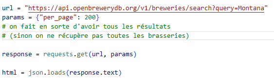
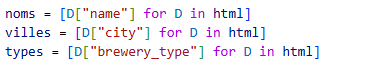
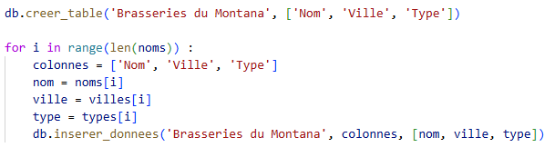

# Analyse de données sur les brasseries au Montana

On étudie dans la suite un jeu de données disponible à l'adresse https://www.openbrewerydb.org/breweries?query=Montana.

## I- Scraping

La première étape consiste à récupérer les données disponibles sur le site. L'implémentation du programme en utilisant la bibliothèque BeautifulSoup ne fonctionnant pas, on a utilisé une autre méthode qui permet de récupérer les données souhaitées.

## II- Définition d'une base de données

Pour stocker les données dans une base, on doit créer une classe base de donnée, avec les méthodes nécessaires pour son utilisation.

On utilise ensuite dans la partie scraping certaines de ces méthodes, pour créer la table et y ajouter les données lorsqu'elles sont recueillies.

## III - Analyse et visualisation

On programme des fonctions utilisant la bibliothèque Pandas permettant d'exploiter les données de la base sous forme de dataframes.
On s'intéresse au nombre de brasseries de chaque type, 